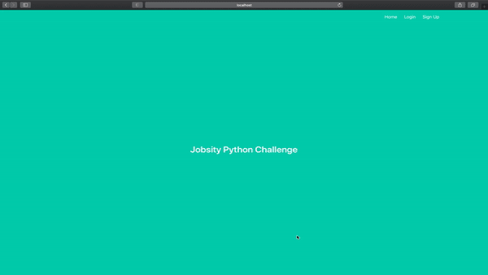
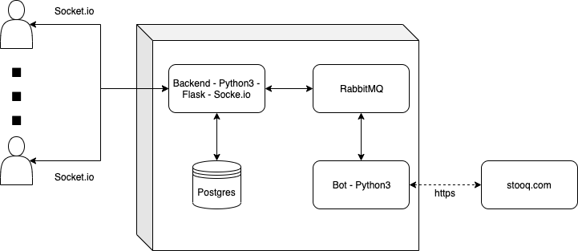

# Python Challenge
## Demo

> [Full demo](https://youtu.be/5CcsI-CIvi4)



## Application Architecture

The application was built using `Flask` and `Flask-SocketIO`. For communicating with the bot that process the commands, `Remote Procedure Calls` were used with `RabbitMQ` as message broker. The database contains a list of supported commands, in this way the bot is completly decoupled as it will only recieve messages that are registered as commands in the database. Furthermore, the application handle not understood messages by the bot, and the bot itself will always give a response even if the external API fails.



> Each components will restart automatically in case of failure

## Run Application

To run the application you need to execute the following command:

```sh
$ docker-compose up --build -d
```

After that, you should be able to access the web application in [localhost](http://localhost:5000). The 5000 port must be available.

> The bot application could take a bit to start due to its dependency towards `rabbitmq`. So please, wait a few seconds before using a command.

## Run Tests

To run web app tests, you should run the following command:

```sh
$ docker-compose exec web pytest
```

To run bot tests, you should run the following command:

```sh
$ docker-compose exec bot pytest
```

## Resources used

In addition to the Flask documentation, I also used a couple of examples and tutorials to complete some parts of this system. These resources are listed here:

- https://www.digitalocean.com/community/tutorials/how-to-add-authentication-to-your-app-with-flask-login
- https://github.com/miguelgrinberg/Flask-SocketIO-Chat
